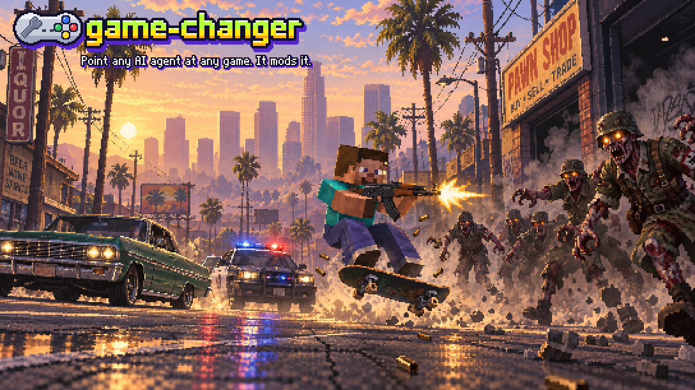
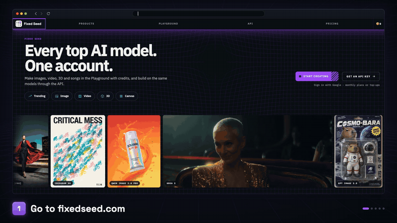

<p align="center">
  
</p>

<p align="center">
  <b>Mod almost any PC game you own with an AI agent.</b><br>
  game-changer teaches Claude Code, Codex, Cursor, Gemini CLI and GitHub Copilot to mod a game from start to
  finish: work out how the game can be modded, build the mod, make its art, 3D models and sound with
  <a href="https://fixedseed.com">FixedSeed</a>, and prove it works in the running game.
</p>

<p align="center">
  <a href="#get-started">Get started</a> ·
  <a href="#what-happens-next">What happens next</a> ·
  <a href="#more-to-ask-for">More to ask for</a> ·
  <a href="#art-3d-and-sound">Art, 3D and sound</a> ·
  <a href="#two-games-at-once">Two games at once</a> ·
  <a href="#field-notes">Field notes</a> ·
  <a href="#examples">Examples</a> ·
  <a href="docs/reference.md">Reference</a>
</p>

## Get started

You need an AI coding agent, Python 3.10 or newer ([uv](https://docs.astral.sh/uv/) recommended) and ffmpeg.
Steps 1 to 4 set up FixedSeed, which makes the art, 3D models and sound. Recon, reverse engineering, testing and
field notes work without it, so you can jump to step 5 and add a key later.

<p align="center">
  
</p>

### 1. Go to [fixedseed.com](https://fixedseed.com)
Click **Get an API key**.

### 2. Sign in with Google

### 3. Create an API key
Click **Create secret**, then **Copy**. The key is shown only once. Give your agent a key of its own, with a
spending limit under **Guardrails**: the API stops that key at its limit, whatever the agent does.

### 4. Add API credits
Under **API billing**, add any amount from $10 to $1,000. A top-up can be spent for a year, and a request that
fails costs nothing.

### 5. Give the key to your agent
Set the key in a terminal and start your agent there:

```bash
export FIXEDSEED_KEY=sk_live_...
claude
```

On Windows, set it in PowerShell with `$env:FIXEDSEED_KEY = "sk_live_..."`.

The first time, add game-changer from inside Claude Code, then restart it:

```text
/plugin marketplace add Fixed-Seed/game-changer
/plugin install game-changer@game-changer
```

`/mcp` now lists **fixedseed** as connected. To keep the key in every new terminal, add the `export` line to
`~/.zshrc` or `~/.bashrc`, or run `setx FIXEDSEED_KEY "sk_live_..."` once on Windows.

<details>
<summary><b>Codex, Gemini CLI, Cursor, VS Code / Copilot, or any other agent</b></summary>
<br>

| Agent | Install once |
|---|---|
| **Codex** | `codex plugin marketplace add Fixed-Seed/game-changer`, then `codex plugin add game-changer` (or pick it in `/plugins`) |
| **Gemini CLI** | `gemini extensions install https://github.com/Fixed-Seed/game-changer` |
| **Cursor** | Paste `https://github.com/Fixed-Seed/game-changer` under **Cursor Settings → Plugins**, or clone it and open the folder |
| **VS Code / Copilot** | Turn on `chat.plugins.enabled`, run **Chat: Install Plugin From Source** and paste the repo URL |
| **Skills only** (any agent) | `npx skills add https://github.com/Fixed-Seed/game-changer` |
| **Anything else** | `git clone https://github.com/Fixed-Seed/game-changer` and start your agent inside the folder |

Each one brings the same skills, the FixedSeed MCP server and the `fsgc` command line (skills only: just the
skills), and they all read the key from `FIXEDSEED_KEY`.
</details>

### 6. Ask for a mod

> Make the Needler from Halo for Terraria.

## What happens next

The agent loads the **mod-any-game** skill and works through the same steps for every mod. For the Needler, it:

1. **Checks the field notes** for Terraria: what other agents learned modding it (`fsgc kb search terraria`).
2. **Finds the game and picks a route**: the install, the engine, tModLoader, anti-cheat and save folders
   (`fsgc scan`), written down in `MODDING_PLAN.md`. It stops at online-only games with anti-cheat.
3. **Sets up a safe lab**: it backs up your saves (`fsgc backup`) and asks before installing a mod loader.
4. **Reads the real code** it needs to hook, decompiled outside the repo and never shipped.
5. **Builds one working piece first**: a Needler that fires, before the homing and the bursts.
6. **Makes the sprite** with FixedSeed, after telling you what it will cost.
7. **Tests it in the game**: it launches Terraria, takes screenshots and fires the gun. It asks before it uses
   your mouse and keyboard.
8. **Records a clip**, and can cut it into a short showcase video.
9. **Packages the mod**, checked for game files and leaked keys.
10. **Writes a field note** on what it learned, and opens a pull request with it only if you say so.

## More to ask for

> Mod Terraria: add a homing missile launcher and a tactical nuke that craters the world.

> Make five new Terraria weapons as pixel-art sprites, and keep the art under a dollar.

> Make a new civilization for Age of Empires II with a unique unit rendered from 3D.

> Retexture Minecraft's cobblestone, stone bricks and oak logs as mossy ruins, as a resource pack.

> Put real Minecraft inside GTA V story mode. Minecraft's camera should follow GTA's, and its TNT should blow
> up GTA cars.

> What engine is `C:\Games\Foo`, and has anyone modded it before?

## Art, 3D and sound

Assets come from FixedSeed, through the bundled MCP server or the `fsgc fixedseed` command. That covers sprites
with real transparency, true pixel-art items, Minecraft block textures, seamless and PBR textures, 3D models from a
picture or a sentence, remeshes, rigs and animation, SVG icons, sound effects, music, voice lines and video. Every
file lands in `assets/gen/` with a line in `fixedseed_manifest.jsonl` (model, inputs, request id), so any asset can
be traced and made again.

**You decide what it spends.**
- The agent prices a plan before it spends anything, and asks you before going over about $5.
- Many assets go out as one batch under a cap. Asking again for the same thing within an hour collects the
  earlier result instead of paying twice.
- The key's spending limit (step 3) is the hard stop. A request the API turns away costs nothing, whether for that
  limit, an empty wallet or too many requests running at once, and the agent is told which limit it hit.

The same commands work in your own terminal:

```bash
# a true pixel-art item, ready for Terraria
fsgc fixedseed item "a copper shortsword with a leather grip"

# 16 px block textures, with the Minecraft model files
fsgc fixedseed block "mossy cobblestone" --namespace mymod

# what a plan costs, before anything is spent
fsgc fixedseed estimate fixedseed/item-sprite:10 tencent/hunyuan3d-3.1:2

# many requests at once, under a cap
fsgc fixedseed batch plan.json --max-cents 300
```

## Two games at once

A passthrough runs two games side by side with a mod in each. One is the game you play in; the other's picture,
objects, collision and events cross a local link into it. The worked example is real Minecraft inside GTA V. Ask
your agent for one, or plan it yourself (no FixedSeed key needed):

```bash
# which game hosts, each engine's hooks, the link and the milestones
fsgc passthrough plan minecraft "gta v"

# the same, and it starts PLAN.md and MODLOG.md in a working folder
fsgc passthrough plan skyrim minecraft --out ~/mods/mc-skyrim
```

It stops at online-only games, flags anti-cheat, and falls back to a content port or an embedded library (Mario 64
via libsm64) when a live link isn't possible. The plan is also a `passthrough` tool and prompt on the MCP server.

## Field notes

[`knowledge/`](knowledge/) holds notes on how specific games were actually modded: the exact versions that worked,
the route and why, how it was verified, and every gotcha (symptom → cause → fix). Agents read them before they
start and write one when they finish, so the next agent starts where yours stopped. Browse
[`knowledge/INDEX.md`](knowledge/INDEX.md), or search from anywhere:

```bash
fsgc kb search "grand theft auto"
```

Every game is welcome. The rules for adding a note, for humans and AIs, are in [`CONTRIBUTING.md`](CONTRIBUTING.md).

## Examples

- **[Seed Arsenal](examples/terraria-tmodloader)** for Terraria (tModLoader): a homing missile launcher, a tactical
  nuke with a crater and a mushroom cloud, a chain-lightning rifle, a black-hole gun, an orbital strike, three new
  enemies and a two-phase Drone Mothership boss. Every sprite was made with FixedSeed.
- **[San Franciscans](examples/aoe2-de-civ)** for Age of Empires II DE: a new civilization with a Robotaxi unique
  unit and Delivery Drones rendered from 3D models at the game's camera angle, a Transamerica Pyramid wonder, and
  a reverse-engineered `.sld` sprite writer.
- **[Minecraft inside GTA V](examples/minecraft-gta5-passthrough)**: a Fabric mod and a ScriptHookV + ReShade add-on
  share the camera, ground and events. Minecraft's frame is depth-composited into GTA's, its TNT, arrows and
  fireworks become GTA explosions and bullets, and its mobs fight the police.

Each has a field note with every non-obvious lesson.

## Rules it follows

- **Any game you own**: single-player, multiplayer, or servers you host. It won't touch online games with
  anti-cheat, write cheats against other players, or get around anti-cheat, DRM or ownership checks.
- **It never ships game files or decompiled code.** Mods ship as code, your own assets, patches or converters.
- **It backs up your saves** before touching them, and stops programs by process ID only.
- **It asks first** before using your mouse and keyboard, installing loaders into game folders, or publishing
  anything, pull requests included.

Full reasoning: [`skills/mod-any-game/references/safety.md`](skills/mod-any-game/references/safety.md).

## Reference

[`docs/reference.md`](docs/reference.md) lists every skill, every `fsgc` command and the MCP tools, and shows
where each agent finds them in a clone. Every `fsgc` command also has `--help`.
