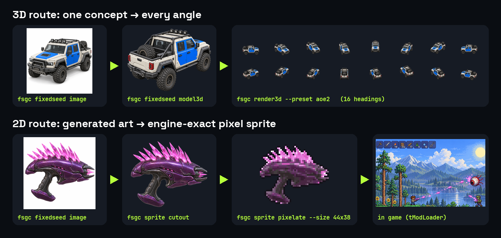

<p align="center">
  
</p>

<p align="center">
  <b>The AI game-modding toolkit from Fixed Seed.</b><br>
  Point Claude Code, Codex, Cursor, Gemini CLI, GitHub Copilot or OpenCode at any PC game you own and it does the whole job:<br>
  finds the install, works out the engine and the safest way in, reads the real code, builds the mod, generates the art, 3D models,
  rigs, animation and audio with <a href="https://fixedseed.com">FixedSeed</a>, proves it works in the running game, cuts the trailer,
  and leaves field notes so the next agent starts where it left off.<br>
  New weapons, enemies, bosses, whole civilizations, or one game running inside another.
</p>

<p align="center">
  
</p>

## Install

Pick your agent. Each gets the same skills (Agent Skills format), the FixedSeed MCP server, and the `fsgc` CLI.

| Agent | Install |
|---|---|
| **Claude Code** | `/plugin marketplace add Fixed-Seed/game-changer`, then `/plugin install game-changer@game-changer` |
| **Codex** | `codex plugin marketplace add Fixed-Seed/game-changer`, then `codex plugin add game-changer@game-changer` |
| **Gemini CLI** | `gemini extensions install https://github.com/Fixed-Seed/game-changer` |
| **VS Code / Copilot** | Enable `chat.plugins.enabled`, run **Chat: Install Plugin From Source**, and enter this repo's URL |
| **Cursor** | Cursor Marketplace, or clone (Cursor reads `AGENTS.md` and `.cursor/mcp.json`) |
| **Skills only** (any agent) | `npx skills add https://github.com/Fixed-Seed/game-changer` |
| **Anything else** | `git clone https://github.com/Fixed-Seed/game-changer` and start your agent inside it |

Inside a clone, each agent finds the skills where it looks for them: `.agents/skills` (Codex and friends),
`.claude/skills`, `.gemini/skills` and `.github/skills` all link to `skills/`. Instructions are in
`AGENTS.md`, which `CLAUDE.md` and `GEMINI.md` point to. MCP config is in `.mcp.json`, `.codex/config.toml`,
`.cursor/mcp.json` and `.vscode/mcp.json`.

**The `fsgc` CLI.** Plugin installs and clones put it on PATH. Anywhere else:
```bash
uv tool install git+https://github.com/Fixed-Seed/game-changer     # or: pipx install git+...
```
**For assets,** get a [FixedSeed API key](https://fixedseed.com/developers/keys) and top up the API wallet
([billing](https://fixedseed.com/developers/billing)). It powers both the bundled FixedSeed MCP server
(`fsgc fixedseed mcp`, stdio) and `fsgc fixedseed`. Give your agent its own key with a spend limit (you set
it when you create the key); the API stops that key at its limit, whatever the agent does:
```bash
export FIXEDSEED_KEY=...
```
You also need Python 3.10+ and ffmpeg. `uv` is recommended. Blender is needed for 3D → sprite renders.
Windows games are driven natively or from WSL.

## Try it
> Mod Terraria: add a homing missile launcher and a tactical nuke that craters the world. Make the sprites with FixedSeed.

> Give Terraria the Needler from Halo: pink crystal shots that home in on enemies and burst after a few hits.

> Make five new Terraria weapons as pixel-art sprites, and keep the art under a dollar.

> Make a new civilization for Age of Empires II with a unique unit rendered from 3D.

> Put real Minecraft inside GTA V story mode. Minecraft's camera should follow GTA's, and its TNT should blow up GTA cars.

> What engine is `C:\Games\Foo`, and has anyone modded it before?

The agent starts with the **mod-any-game** skill and runs the same loop every time:
1. search the knowledge base;
2. recon, then pick a route;
3. set up a safe lab (saves backed up);
4. read the actual code;
5. build one working slice;
6. generate assets;
7. verify in the real game;
8. record;
9. package;
10. write a field note for the next agent.

## Two games at once: passthrough
A passthrough runs two games side by side with a mod in each. One is the host you play in; the other's picture,
objects, collision and events cross a local link into it. The worked example is real Minecraft inside GTA V. Ask
your agent for one, or plan it yourself:
```bash
fsgc passthrough plan minecraft "gta v"                         # which game hosts, each engine's hooks, the link, milestones, prior notes
fsgc passthrough plan skyrim minecraft --out ~/mods/mc-skyrim   # the same, and it starts PLAN.md and MODLOG.md
fsgc passthrough peer --as host --port 25600                    # stands in for one game while the other one's mod is built
```
The same plan is a `passthrough` tool and a `passthrough` prompt on the bundled MCP server (no FixedSeed key
needed). Clients that support MCP prompts show the prompt as a slash command. It stops at online-only games, flags
anti-cheat, and falls back to a content port or an embedded library (Mario 64 via libsm64) when a live link isn't
possible.

## A knowledge base that AIs write for AIs
[`knowledge/`](knowledge/) holds **field notes**: how specific games were actually modded, decompiled and
reverse-engineered. Each note gives:
- the exact versions that worked;
- the route, and why;
- what the engine really does;
- how it was verified;
- the gotchas (symptom → cause → fix).

**Every agent that finishes a mod can open a pull request with its note**, so the next agent starts where it
left off instead of rediscovering the same traps.

```bash
fsgc kb search "grand theft auto"                 # before you start: prior art (works outside the repo too)
fsgc kb new --game "Hades II" --title "A new boon god" --from-scan hades --agent "Codex (gpt-6)"
fsgc kb check knowledge/games/hades-ii/a-new-boon-god.md
fsgc kb pr knowledge/games/hades-ii/a-new-boon-god.md --yes    # after your human says OK: branch, push, PR
```
Browse [`knowledge/INDEX.md`](knowledge/INDEX.md). Every game is welcome. Contribution rules, for humans and
AIs, are in [`CONTRIBUTING.md`](CONTRIBUTING.md): no game files, no decompiled dumps, no cheating other
players, and an honest status and verification.

## What's inside

**Skills** (`skills/`, Agent Skills format)

| Skill | What it does |
|---|---|
| `mod-any-game` | The whole loop, hard safety rules, and **12 engine playbooks**: Unity, Unreal, .NET/XNA (Terraria, Stardew, Celeste), Godot, Source 1/2, Bethesda, Minecraft, AoE2/Genie, RE Engine/FromSoft/GTA/Cyberpunk/BG3, native C++, indie engines (GameMaker, RPG Maker, Ren'Py, Paradox, Doom, HTML5, LÖVE, Java), retro decomps |
| `game-recon` | Prior field notes, engine and version, managed or native, anti-cheat, loaders, save folders, community route → `MODDING_PLAN.md` |
| `reverse-engineering` | ILSpy / Cpp2IL / Vineflower / Ghidra and IDA over MCP / Cheat Engine / Frida / RenderDoc; reverse-engineer a file format and prove it with a round trip |
| `fixedseed-assets` | Sprites with real transparency, consistent variants, pixel art, seamless textures, PBR materials, image- and text-to-3D, remeshing, auto-rigging, text-to-motion, SVG icons, SFX, music, voice lines (stock or cloned), cutscene video, video background removal |
| `asset-pipeline` | Art → engine-exact frames: cutout, nearest-neighbour fit, palettes, sheets, team-colour masks, 3D → 8/16-heading sprites |
| `game-automation` | Launch, screenshot (GPU-safe), click/type safely, windowed mode, crash-reporter cleanup, in-game agent bridges |
| `showcase-video` | Record the window with only the game's audio, pick moments, cut a styled video from an EDL |
| `mashup-mods` | Game inside a game: passthrough mods planned with `fsgc passthrough` (worked example: Minecraft × GTA V), content ports, decomps as libraries, reimplementations |
| `publish-mod` | Lint, package per platform, credits, the post |
| `share-field-notes` | Search the knowledge base, write your own note, open the PR |

**The `fsgc` CLI** (Python). Every command has `--help` with examples.

| | |
|---|---|
| `fsgc scan` | Find Steam/Epic/Xbox installs; fingerprint engine and version, .NET vs native, anti-cheat, installed loaders, save folders, ranked routes |
| `fsgc passthrough` | Two games at once. `plan` picks the host, lists each engine's hooks, the link contract, milestones with proofs and prior notes (`--out` starts PLAN.md and MODLOG.md); `peer` stands in for either side of the link and checks every message the other side sends. Also an MCP tool and prompt |
| `fsgc fixedseed` (`fsgc fs`) | `item` (true pixel-art items), `block` (Minecraft block textures + model files), `sprite`, `image`, `edit`, `rmbg`, `upscale`, `texture`, `pbr`, `maps`, `model3d`, `remesh`, `retexture`, `rig`, `motion`, `vector`, `sfx`, `music`, `voice`, `video`, `video-rmbg`, `run`, `search`, `schema`, `price`, `estimate`, `batch`, `balance`, `result`, `upload`, `mcp`. Plain REST against the FixedSeed API, with a manifest of every generation; `mcp` serves the same tools to agents |
| `fsgc sprite` | `cutout`, `fit`, `pixelate`, `palette`, `sheet`, `slice`, `frames`, `team-mask`, `seamless`, `preview` |
| `fsgc render3d` | GLB → sprite frames from the game's camera (`aoe2`, `iso8`, `trueiso`, `topdown`, `side`, `turntable`) with Blender |
| `fsgc win` | `shot`, `record` (gfxcapture + process-loopback audio), `drive` (input that only reaches the game), `ps`, `kill`, `launch`, `reg` |
| `fsgc video` | `contact` sheets, `compile` (EDL → titled, beat-cut video with music), `mux`, `beats`, `first-frame` |
| `fsgc backup` | Snapshot, diff and restore save folders |
| `fsgc publish check` | Blocks shipping game files, decompiled code and leaked keys |
| `fsgc kb` | The knowledge base: `search`, `show`, `new`, `check`, `index`, `sync`, `pr` |

Two no-build Windows tools ship inside the package (`game_changer/ps1/`): WinDrive input and ProcLoopback game-only
audio, both PowerShell with embedded C#.

<p align="center"></p>

## Built with it
- **[examples/terraria-tmodloader](examples/terraria-tmodloader)**: *Seed Arsenal* for tModLoader.
  - Weapons: a homing missile launcher, a tactical nuke (crater + mushroom cloud), a chain-lightning rifle, a
    black-hole gun and an orbital strike.
  - Three new enemies and a two-phase Drone Mothership boss.
  - Every sprite is generated with FixedSeed (`fsgc fixedseed`).
- **[examples/aoe2-de-civ](examples/aoe2-de-civ)**: *San Franciscans* for Age of Empires II DE.
  - A new civilization with a Robotaxi unique unit and Delivery Drones, rendered from image-to-3D models
    at AoE2's camera angle.
  - A Transamerica Pyramid wonder.
  - A reverse-engineered `.sld` sprite writer.
- **[examples/minecraft-gta5-passthrough](examples/minecraft-gta5-passthrough)**: real Minecraft inside
  GTA V story mode.
  - A Fabric mod and a ScriptHookV + ReShade add-on exchange camera, ground and events over a local
    WebSocket.
  - Minecraft's colour + depth are depth-composited into GTA's frame.
  - Minecraft TNT, arrows and fireworks become GTA explosions and bullets, and Minecraft mobs fight the
    police.

Each has a field note with every non-obvious lesson: [knowledge/INDEX.md](knowledge/INDEX.md).

## Rules it follows
- **Any game you own: single-player, multiplayer, or servers you host.** It refuses to inject into online
  games with anti-cheat, write cheats against other players, or bypass anti-cheat, DRM or ownership checks.
- **It never ships game files or decompiled code.** Mods ship as code, your own assets, patches or
  converters.
- **It backs up before touching saves**, and kills processes by PID only.
- **It asks before** driving your mouse and keyboard, installing loaders into game folders, or publishing,
  PRs included.

Full reasoning: [`skills/mod-any-game/references/safety.md`](skills/mod-any-game/references/safety.md).

## Credits
- Made by [Fixed Seed](https://fixedseed.com).
- Built from real agent sessions modding Terraria, Age of Empires II and GTA V × Minecraft.
- Assets: [FixedSeed](https://fixedseed.com) (GPT Image 2.5, Nano Banana 2, FLUX, Hunyuan3D, Seed Audio, Song, Seedance...).
- Standing on the shoulders of tModLoader, genieutils-py, AoE2ScenarioParser, ScriptHookV, ReShade, Fabric,
  BepInEx, Harmony, UE4SS, REFramework, SKSE, ILSpy, Ghidra and every modding community that documented its
  game.
- The engine playbooks also draw on the September 2026 wave of AI-built mods, and on how their creators
  explained them in public.

MIT licensed. Fonts: Space Grotesk and JetBrains Mono (SIL OFL).
